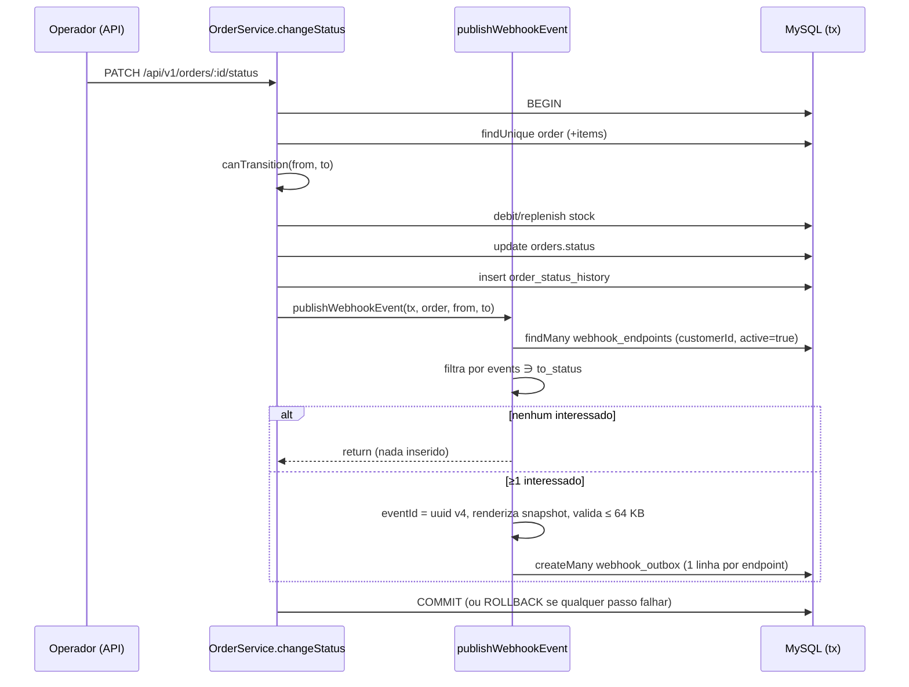
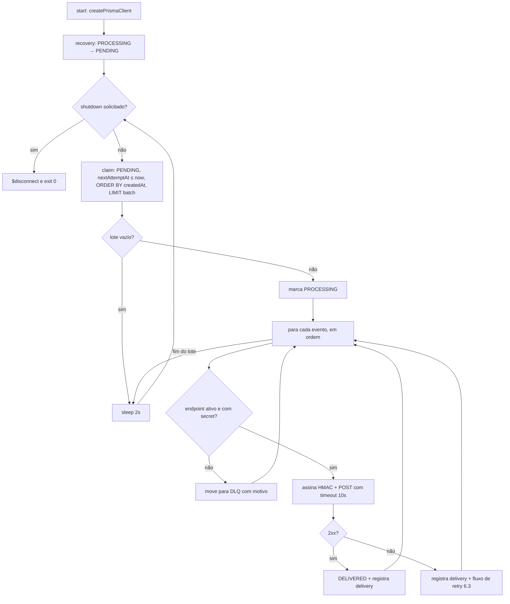

# FDD — Sistema de Webhooks de Notificação de Pedidos

| Campo | Valor |
| --- | --- |
| **Autor** | Henrique Castro |
| **Status** | Pronto para implementação (pendente revisão com Bruno e Diego) |
| **Data** | 2026-09-28 |
| **Base** | [RFC](RFC.md) · [ADR-001 a ADR-007](adrs/) · [PRD](PRD.md) |
| **Rastreabilidade** | Cada item com ID (`FDD-*`) está mapeado em [TRACKER.md](TRACKER.md) |

> Este documento descreve **como construir**. As justificativas de cada decisão estão nos ADRs, e a visão de produto está no PRD. Quando uma escolha de implementação não veio da reunião e foi definida aqui para tornar a especificação acionável, ela está marcada com **(def. FDD)**.

---

## 1. Contexto e motivação técnica

- A mudança de status de pedido é feita em `OrderService.changeStatus` ([src/modules/orders/order.service.ts](../src/modules/orders/order.service.ts)), dentro de `prisma.$transaction`. Essa transação valida a máquina de estados ([src/modules/orders/order.status.ts](../src/modules/orders/order.status.ts)), debita ou repõe estoque, atualiza `orders` e grava `order_status_history`.
- Não existe mecanismo de eventos, fila ou notificação externa na aplicação.
- Clientes B2B precisam ser avisados **em menos de 10 s** de cada mudança de status relevante para eles, sem polling em `GET /orders`.
- A solução precisa ser **atômica** com a mudança de status ([ADR-001](adrs/ADR-001-outbox-no-mysql.md)) e **isolada** da disponibilidade do cliente ([ADR-002](adrs/ADR-002-worker-separado-em-polling.md)).

## 2. Objetivos técnicos

| ID | Objetivo | Como medir |
| --- | --- | --- |
| FDD-OBJ-01 | Nenhuma mudança de status sem o evento correspondente na outbox, e nenhum evento de transação revertida | Teste de integração: falha forçada no insert da outbox gera rollback do status |
| FDD-OBJ-02 | Latência de entrega p95 < 10 s com cliente saudável | `delivered_at - created_at` na outbox (ver §10) |
| FDD-OBJ-03 | Todo evento termina em `DELIVERED` ou na DLQ, em no máximo cerca de 15 h | Nenhuma linha `PENDING` com `attempts > 5`. Nenhuma linha com mais de 15 h sem estado final |
| FDD-OBJ-04 | Toda requisição de saída é assinada com HMAC-SHA256 e vai só para HTTPS | Teste unitário do signer. Validação de URL |
| FDD-OBJ-05 | Zero infraestrutura e zero dependências npm novas | Revisão do `package.json` no PR |

## 3. Escopo e exclusões

**Dentro do escopo**

- Módulo `src/modules/webhooks` com CRUD de configuração, rotação de secret, histórico de entregas e replay de DLQ.
- Tabelas `webhook_endpoints`, `webhook_outbox`, `webhook_deliveries` e `webhook_dead_letter`.
- Função `publishWebhookEvent` chamada em `changeStatus`.
- Entry-point `src/worker.ts` e script `npm run worker`.
- Assinatura HMAC, retry com backoff, DLQ e logs estruturados.

**Fora do escopo** (decidido na reunião)

| Item | Origem |
| --- | --- |
| Webhooks inbound (cliente → plataforma) | [09:02] Marcos |
| Aviso por e-mail quando o webhook falha repetidamente (próxima fase) | [09:37] Larissa |
| Rate limiting de saída ("observar e decidir depois") | [09:39] Larissa |
| Dashboard visual para o cliente (projeto do time de frontend) | [09:40] Larissa |
| Arquivamento das linhas entregues da outbox | [09:08] Diego |
| Múltiplos workers em paralelo / ordem global | [09:13] Diego |

**Fora do escopo** (identificado no código, não discutido)

| Item | Motivo |
| --- | --- |
| Evento na **criação** do pedido (`null → PENDING`) | `OrderService.create` grava o histórico direto, sem passar por `changeStatus`. A reunião tratou só da mudança de status. Ver [RFC Q7](RFC.md#6-questões-em-aberto). |
| Evento na **exclusão** do pedido (`OrderService.delete`) | Não é mudança de status. |
| Endpoint de **listagem** da DLQ | Não foi pedido. O admin obtém o `id` pelo log `webhook_dead_lettered` (§10) ou por consulta direta. |

## 4. Visão geral e estrutura de arquivos

```
src/
├── worker.ts                          # NOVO entry-point do worker (processo separado)
└── modules/
    └── webhooks/                      # NOVO módulo, mesmo padrão de src/modules/orders
        ├── webhook.routes.ts          # /webhooks e /admin/webhooks
        ├── webhook.controller.ts
        ├── webhook.service.ts         # CRUD, rotação, deliveries, replay
        ├── webhook.repository.ts
        ├── webhook.schemas.ts         # Zod (inclui regra https)
        ├── webhook.errors.ts          # classes WEBHOOK_* (estendem src/shared/errors)
        ├── webhook.publisher.ts       # publishWebhookEvent(tx, order, from, to)
        ├── webhook.processor.ts       # lógica do worker: claim, envio, retry, DLQ
        ├── webhook.signer.ts          # HMAC-SHA256 + geração de secret
        └── webhook.constants.ts       # BACKOFF_SCHEDULE, limites, event_type
```

## 5. Modelo de dados

Migration aditiva em [prisma/schema.prisma](../prisma/schema.prisma). Todos os IDs são UUID `Char(36)`, seguindo o padrão do projeto ([09:51] Larissa).

```prisma
enum WebhookOutboxStatus {
  PENDING
  PROCESSING
  DELIVERED
  FAILED
}

model WebhookEndpoint {
  id                      String    @id @default(uuid()) @db.Char(36)
  customerId              String    @db.Char(36)
  url                     String    @db.VarChar(2048)
  secret                  String    @db.VarChar(128)
  previousSecret          String?   @db.VarChar(128)   // válida até previousSecretExpiresAt
  previousSecretExpiresAt DateTime?
  events                  Json                          // ex.: ["SHIPPED","DELIVERED"]
  active                  Boolean   @default(true)
  createdAt               DateTime  @default(now())
  updatedAt               DateTime  @updatedAt

  customer   Customer                 @relation(fields: [customerId], references: [id])
  outbox     WebhookOutbox[]
  deliveries WebhookDelivery[]
  deadLetter WebhookDeadLetter[]

  @@index([customerId, active])
  @@map("webhook_endpoints")
}

model WebhookOutbox {
  id            String              @id @default(uuid()) @db.Char(36)
  eventId       String              @db.Char(36)       // X-Event-Id, estável em retry/replay
  webhookId     String              @db.Char(36)
  orderId       String              @db.Char(36)
  eventType     String              @db.VarChar(64)    // "order.status_changed"
  payload       String              @db.MediumText     // JSON já serializado (snapshot)
  status        WebhookOutboxStatus @default(PENDING)
  attempts      Int                 @default(0)
  nextAttemptAt DateTime            @default(now())
  lastError     String?             @db.VarChar(500)
  deliveredAt   DateTime?
  createdAt     DateTime            @default(now())
  updatedAt     DateTime            @updatedAt

  webhook    WebhookEndpoint   @relation(fields: [webhookId], references: [id], onDelete: Cascade)
  deliveries WebhookDelivery[]

  @@unique([eventId, webhookId])
  @@index([status, createdAt])
  @@index([nextAttemptAt])
  @@index([orderId])
  @@map("webhook_outbox")
}

model WebhookDelivery {
  id             String   @id @default(uuid()) @db.Char(36)
  outboxId       String   @db.Char(36)
  webhookId      String   @db.Char(36)
  eventId        String   @db.Char(36)
  attemptNumber  Int
  success        Boolean
  responseStatus Int?
  responseBody   String?  @db.Text        // truncado em 64 KB (def. FDD)
  errorCode      String?  @db.VarChar(64) // WEBHOOK_DELIVERY_*
  durationMs     Int
  createdAt      DateTime @default(now())

  outbox  WebhookOutbox   @relation(fields: [outboxId], references: [id], onDelete: Cascade)
  webhook WebhookEndpoint @relation(fields: [webhookId], references: [id], onDelete: Cascade)

  @@index([webhookId, createdAt])
  @@map("webhook_deliveries")
}

model WebhookDeadLetter {
  id            String    @id @default(uuid()) @db.Char(36)
  outboxId      String    @unique @db.Char(36)
  webhookId     String    @db.Char(36)
  eventId       String    @db.Char(36)
  payload       String    @db.MediumText
  failureReason String    @db.VarChar(1000)
  attempts      Int
  failedAt      DateTime  @default(now())
  replayedAt    DateTime?
  replayedById  String?   @db.Char(36)

  webhook WebhookEndpoint @relation(fields: [webhookId], references: [id], onDelete: Cascade)

  @@index([failedAt])
  @@map("webhook_dead_letter")
}
```

`model Customer` ganha a back-relation `webhooks WebhookEndpoint[]`.

**Notas de modelagem**

- **Uma linha de outbox por par (evento, endpoint).** Cada endpoint tem secret, URL e `X-Webhook-Id` próprios. Por isso cada um tem retry e DLQ independentes. O `eventId` é compartilhado pelas linhas do mesmo evento, que é "único por evento" ([09:25] Diego). A unicidade é garantida por `@@unique([eventId, webhookId])`.
- **`payload` é `MediumText` com o JSON já serializado.** A assinatura HMAC é calculada sobre os bytes exatos do corpo. Guardar a string garante corpo idêntico em todo retry e replay. O tipo `TEXT` do MySQL tem teto de 65.535 bytes, 1 byte abaixo do limite de 64 KB (65.536 bytes) (def. FDD).
- **Índices:** `status` + `created_at`, conforme [09:08] Diego, e `nextAttemptAt` para o agendamento de retry.

## 6. Fluxos detalhados

### 6.1 Criação do evento na outbox (API, dentro de `changeStatus`)



Passo a passo de `publishWebhookEvent(tx, order, fromStatus, toStatus)`:

1. Buscar `webhook_endpoints` com `customerId = order.customerId` e `active = true`, usando o **`tx` recebido**, nunca o client global.
2. Manter só os endpoints cujo `events` contém `toStatus` ([09:33] Marcos, [09:34] Bruno). Se sobrar nenhum, `return` sem inserir nada.
3. Gerar `eventId` (UUID v4, via `uuid`, que já está no projeto) **uma vez** para o evento ([09:25] Diego).
4. Montar o payload (§7.1) com `timestamp = new Date().toISOString()` e serializar com `JSON.stringify`.
5. Se `Buffer.byteLength(body) > 65_536`, lançar `WebhookPayloadTooLargeError`. **Não trunca** ([09:23] Sofia, [09:24] Larissa). O erro propaga, a transação faz rollback e o status não muda. Com o payload enxuto, isso é praticamente inalcançável.
6. `tx.webhookOutbox.createMany` com uma linha por endpoint: mesmo `eventId`, mesmo `payload`, `status = PENDING`, `attempts = 0` e `nextAttemptAt = now()`.
7. Qualquer exceção sobe para o `$transaction`, que faz **rollback de tudo** ([09:40] Bruno).

### 6.2 Processamento pelo worker



1. **Bootstrap** (`src/worker.ts`): `const prisma = createPrismaClient()`. É uma instância **nova**, na mesma `DATABASE_URL` ([09:30] Bruno). Registra handlers de `SIGINT`/`SIGTERM` no mesmo formato de [src/server.ts](../src/server.ts).
2. **Recuperação de crash:** `updateMany({ where: { status: 'PROCESSING' }, data: { status: 'PENDING' } })`. Isso é seguro porque a garantia é at-least-once ([ADR-005](adrs/ADR-005-entrega-at-least-once-com-x-event-id.md)). Vale enquanto houver um único worker ([ADR-002](adrs/ADR-002-worker-separado-em-polling.md)).
3. **Claim:** `findMany({ where: { status: 'PENDING', nextAttemptAt: { lte: now } }, orderBy: { createdAt: 'asc' }, take: WEBHOOK_BATCH_SIZE })`, seguido de `updateMany` para `PROCESSING` com esses ids.
4. **Envio sequencial, em ordem de `createdAt`.** Preserva a ordem por `order_id` no caso sem falhas ([09:12] Diego).
5. Para cada linha:
   - carregar o endpoint;
   - se estiver inativo ou tiver sido removido → DLQ (`WEBHOOK_INACTIVE`);
   - se estiver sem secret → DLQ (`WEBHOOK_SECRET_REQUIRED`), porque **nunca se envia sem assinatura**;
   - montar os headers (§7.1);
   - chamar `fetch(url, { method: 'POST', body: payload, headers, signal: AbortSignal.timeout(10_000), redirect: 'manual' })`;
   - gravar uma linha em `webhook_deliveries` com status, corpo da resposta (truncado), `durationMs` e `errorCode`;
   - `2xx` → `status = DELIVERED`, `deliveredAt = now()`, `attempts += 1`;
   - qualquer outro resultado → §6.3.
6. **Pausa de 2 s** (`setTimeout`) **depois** de cada ciclo, em vez de `setInterval`, para não sobrepor ciclos ([09:09] Diego).
7. **Shutdown gracioso:** a flag interrompe o loop depois do evento em curso. Em seguida, `prisma.$disconnect()`.

### 6.3 Retry

`BACKOFF_SCHEDULE = [60_000, 300_000, 1_800_000, 7_200_000, 43_200_000]` (1m, 5m, 30m, 2h, 12h) ([09:17] Larissa).

Após uma tentativa que falhou, com `attempts` já incrementado para `n`:

| `n` (tentativas feitas) | Ação |
| --- | --- |
| 1 a 5 | `status = PENDING`, `nextAttemptAt = now + BACKOFF_SCHEDULE[n-1]`, `lastError = <código>` → log `webhook_retry_scheduled` |
| 6 | Esgotou: 1 inicial + 5 retentativas. Vai para o fluxo §6.4 com motivo `WEBHOOK_MAX_ATTEMPTS_EXCEEDED` |

A janela total entre a primeira falha e a última tentativa é de 14h36min ([09:17] Diego). A interpretação "1 + 5" está registrada no [ADR-003](adrs/ADR-003-retry-com-backoff-exponencial-e-dlq.md).

### 6.4 DLQ e replay

**Movimentação para a DLQ.** É feita numa transação do worker:

1. `insert webhook_dead_letter` com `outboxId`, `webhookId`, `eventId`, `payload`, `failureReason` (último código + status/mensagem), `attempts` e `failedAt`.
2. `update webhook_outbox set status = FAILED`.
3. Log `webhook_dead_lettered` em nível `warn`.

**Replay:** `POST /api/v1/admin/webhooks/dead-letter/:id/replay`, só para `ADMIN` ([09:36] Sofia).

1. Buscar a linha da DLQ. Se não existir → `WEBHOOK_DEAD_LETTER_NOT_FOUND`.
2. Se a linha de outbox correspondente não estiver `FAILED` (replay já em andamento) → `WEBHOOK_ALREADY_REPLAYED`.
3. Se o endpoint estiver inativo → `WEBHOOK_INACTIVE`.
4. Numa transação:
   - atualizar a linha **original** da outbox para `status = PENDING`, `attempts = 0`, `nextAttemptAt = now()`, `lastError = null`, mantendo **o mesmo `eventId` e o mesmo `payload`**, para o cliente conseguir deduplicar;
   - atualizar a DLQ com `replayedAt = now()` e `replayedById = req.user.id`.
5. Log `webhook_dlq_replayed` com `{ deadLetterId, eventId, webhookId, replayedBy: req.user.id }`. É a auditoria pedida em [09:36] Sofia.

### 6.5 Rotação de secret

`POST /api/v1/webhooks/:id/rotate-secret` ([09:21] Sofia):

1. `previousSecret = secret atual`, `previousSecretExpiresAt = now + 24h`.
2. `secret = generateSecret()`, que é `crypto.randomBytes(32).toString('hex')` (def. FDD, sujeito à revisão da Sofia).
3. Se já existia uma `previousSecret` ainda válida, ela é **sobrescrita**. Só convivem duas secrets: a atual e a imediatamente anterior (def. FDD).
4. Na assinatura (§7.1), o worker ignora a `previousSecret` se `previousSecretExpiresAt < now`.

## 7. Contratos públicos

Todos os endpoints REST ficam sob `/api/v1`, montados em [src/routes/index.ts](../src/routes/index.ts). Todos exigem `Authorization: Bearer <JWT>` (`authenticate`). Os erros seguem o formato do error middleware: `{ "error": { "code", "message", "details?" } }`.

### 7.1 Requisição de webhook enviada ao cliente (outbound)

```http
POST https://hooks.atlas.example/oms-events HTTP/1.1
Content-Type: application/json
X-Event-Id: 7d9f1c2e-3b8a-4f61-9a0e-2c5b8e4d1f00
X-Webhook-Id: 0b6c7e4a-1f2d-4c3b-8a9e-5d6f7a8b9c01
X-Timestamp: 2026-11-20T14:32:07.412Z
X-Signature: sha256=5f0c2b...e91a

{
  "event_id": "7d9f1c2e-3b8a-4f61-9a0e-2c5b8e4d1f00",
  "event_type": "order.status_changed",
  "timestamp": "2026-11-20T14:32:05.118Z",
  "order_id": "c1a2b3d4-e5f6-4a7b-8c9d-0e1f2a3b4c5d",
  "order_number": "ORD-000123",
  "from_status": "PROCESSING",
  "to_status": "SHIPPED",
  "customer_id": "9e8d7c6b-5a4f-4e3d-2c1b-0a9f8e7d6c5b",
  "total_cents": 158900
}
```

| Header | Conteúdo | Origem |
| --- | --- | --- |
| `Content-Type` | `application/json` | [09:44] Diego |
| `X-Event-Id` | UUID do evento, estável em retries e replays | [09:25] Diego |
| `X-Webhook-Id` | `id` do endpoint cadastrado | [09:44] Sofia |
| `X-Timestamp` | Instante ISO 8601 do **envio** (muda a cada tentativa), para o cliente detectar replay | [09:44] Diego |
| `X-Signature` | `sha256=` + hex de `HMAC_SHA256(secret, rawBody)` | [09:20] Sofia, [09:22] Sofia |

- **Corpo:** snapshot gravado na inserção, sem `items` ([09:43] Diego). O `timestamp` do corpo é o instante da mudança de status. `order_number` segue o formato `ORD-000000` gerado por `reserveOrderNumber` ([order.service.ts](../src/modules/orders/order.service.ts)).
- **Durante o grace period de rotação:** `X-Signature: sha256=<hex com secret atual>,sha256=<hex com secret anterior>`. O cliente aceita se **qualquer** uma bater (def. FDD, sujeito à revisão da Sofia, [RFC Q6](RFC.md#6-questões-em-aberto)).
- **Semântica da resposta do cliente:** `2xx` em até 10 s significa sucesso. Qualquer outra coisa é falha e entra em retry: 3xx (redirects não são seguidos), 4xx, 5xx, timeout ou erro de rede.

### 7.2 `POST /api/v1/webhooks` — cadastrar endpoint

Auth: qualquer role autenticada ([09:37] Sofia). O `customerId` vai no **body** e não é derivado do JWT ([09:32] Larissa).

Request:

```json
{
  "customerId": "9e8d7c6b-5a4f-4e3d-2c1b-0a9f8e7d6c5b",
  "url": "https://hooks.atlas.example/oms-events",
  "events": ["SHIPPED", "DELIVERED"]
}
```

Response `201 Created` (a **secret aparece só aqui e na rotação**):

```json
{
  "id": "0b6c7e4a-1f2d-4c3b-8a9e-5d6f7a8b9c01",
  "customerId": "9e8d7c6b-5a4f-4e3d-2c1b-0a9f8e7d6c5b",
  "url": "https://hooks.atlas.example/oms-events",
  "events": ["SHIPPED", "DELIVERED"],
  "active": true,
  "secret": "3f9a1c...64 hex...b7e2",
  "createdAt": "2026-11-20T13:00:00.000Z",
  "updatedAt": "2026-11-20T13:00:00.000Z"
}
```

| Status | Quando |
| --- | --- |
| 201 | Criado |
| 400 `VALIDATION_ERROR` | Body fora do schema (campo faltando, tipo errado) |
| 400 `WEBHOOK_INVALID_URL` | URL malformada ou não `https` ([09:23] Sofia) |
| 400 `WEBHOOK_INVALID_EVENTS` | `events` vazio ou com status que nunca é destino de transição (`PENDING`) |
| 401 `UNAUTHORIZED` | Sem JWT ou JWT inválido |
| 404 `WEBHOOK_CUSTOMER_NOT_FOUND` | `customerId` inexistente |

Valores válidos em `events`: `PAID`, `PROCESSING`, `SHIPPED`, `DELIVERED`, `CANCELLED`, que são os destinos possíveis do mapa `transitions` em [order.status.ts](../src/modules/orders/order.status.ts). `PENDING` nunca é `to_status` em `changeStatus`.

### 7.3 `GET /api/v1/webhooks?customerId=:id&page=1&pageSize=20` — listar endpoints de um customer

Auth: qualquer role autenticada. `customerId` é **obrigatório** ([09:33] Bruno: "GET pra listar os webhooks de um customer").

Response `200 OK`, no formato `paginated()` de [src/shared/http/response.ts](../src/shared/http/response.ts), **sem `secret`**:

```json
{
  "data": [
    {
      "id": "0b6c7e4a-1f2d-4c3b-8a9e-5d6f7a8b9c01",
      "customerId": "9e8d7c6b-5a4f-4e3d-2c1b-0a9f8e7d6c5b",
      "url": "https://hooks.atlas.example/oms-events",
      "events": ["SHIPPED", "DELIVERED"],
      "active": true,
      "createdAt": "2026-11-20T13:00:00.000Z",
      "updatedAt": "2026-11-20T13:00:00.000Z"
    }
  ],
  "pagination": { "page": 1, "pageSize": 20, "total": 1, "totalPages": 1 }
}
```

| Status | Quando |
| --- | --- |
| 200 | OK (lista vazia se não houver endpoints) |
| 400 `VALIDATION_ERROR` | `customerId` ausente ou não-UUID |
| 401 `UNAUTHORIZED` | Sem JWT |

### 7.4 `PATCH /api/v1/webhooks/:id` — editar endpoint

Request (todos os campos são opcionais, com pelo menos um obrigatório):

```json
{ "url": "https://hooks.atlas.example/v2/oms-events", "events": ["PAID", "SHIPPED", "DELIVERED"], "active": true }
```

Response `200 OK`: o mesmo objeto do GET, **sem `secret`**.

| Status | Quando |
| --- | --- |
| 200 | Atualizado. As novas preferências valem **só para eventos futuros** ([ADR-007](adrs/ADR-007-payload-snapshot-e-filtro-na-insercao.md)) |
| 400 `VALIDATION_ERROR` / `WEBHOOK_INVALID_URL` / `WEBHOOK_INVALID_EVENTS` | Como no POST |
| 401 `UNAUTHORIZED` | Sem JWT |
| 404 `WEBHOOK_NOT_FOUND` | `id` inexistente |

`active: false` pausa o endpoint. Eventos novos deixam de ser gerados para ele, e os já enfileirados vão para a DLQ com `WEBHOOK_INACTIVE` quando chegam ao worker.

### 7.5 `DELETE /api/v1/webhooks/:id` — remover endpoint

Request: sem body. Response `204 No Content`.

| Status | Quando |
| --- | --- |
| 204 | Removido. Outbox, deliveries e DLQ do endpoint são removidos em cascata (`onDelete: Cascade`) |
| 401 `UNAUTHORIZED` | Sem JWT |
| 404 `WEBHOOK_NOT_FOUND` | `id` inexistente |

### 7.6 `POST /api/v1/webhooks/:id/rotate-secret` — rotacionar secret

Request: sem body. Response `200 OK`:

```json
{
  "id": "0b6c7e4a-1f2d-4c3b-8a9e-5d6f7a8b9c01",
  "secret": "a41be0...64 hex...0c9d",
  "previousSecretExpiresAt": "2026-11-21T13:05:00.000Z"
}
```

| Status | Quando |
| --- | --- |
| 200 | Nova secret gerada. A anterior vale por mais 24 h ([09:21] Sofia) |
| 401 `UNAUTHORIZED` | Sem JWT |
| 404 `WEBHOOK_NOT_FOUND` | `id` inexistente |

### 7.7 `GET /api/v1/webhooks/:id/deliveries` — histórico de entregas

Retorna as **últimas 100 tentativas**, da mais recente para a mais antiga ([09:34] Marcos).

Response `200 OK`:

```json
{
  "data": [
    {
      "id": "e2d1c0b9-a8f7-4e6d-5c4b-3a2f1e0d9c8b",
      "eventId": "7d9f1c2e-3b8a-4f61-9a0e-2c5b8e4d1f00",
      "attemptNumber": 1,
      "success": true,
      "responseStatus": 200,
      "responseBody": "{\"received\":true}",
      "errorCode": null,
      "durationMs": 184,
      "payload": { "event_id": "7d9f1c2e-...", "event_type": "order.status_changed", "to_status": "SHIPPED" },
      "createdAt": "2026-11-20T14:32:07.600Z"
    },
    {
      "id": "f3e2d1c0-b9a8-4f7e-6d5c-4b3a2f1e0d9c",
      "eventId": "1a2b3c4d-5e6f-4a7b-8c9d-0e1f2a3b4c5d",
      "attemptNumber": 2,
      "success": false,
      "responseStatus": null,
      "responseBody": null,
      "errorCode": "WEBHOOK_DELIVERY_TIMEOUT",
      "durationMs": 10000,
      "payload": { "event_id": "1a2b3c4d-...", "event_type": "order.status_changed", "to_status": "PROCESSING" },
      "createdAt": "2026-11-20T12:10:31.004Z"
    }
  ]
}
```

(`payload` foi abreviado no exemplo. Na resposta real vem o JSON completo da outbox.)

| Status | Quando |
| --- | --- |
| 200 | OK |
| 401 `UNAUTHORIZED` | Sem JWT |
| 404 `WEBHOOK_NOT_FOUND` | `id` inexistente |

### 7.8 `POST /api/v1/admin/webhooks/dead-letter/:id/replay` — reprocessar DLQ

Auth: `authenticate` + `requireRole('ADMIN')` ([09:36] Larissa). Request: sem body.

Response `202 Accepted` (o evento volta para a fila e é entregue de forma assíncrona):

```json
{
  "deadLetterId": "5c4b3a2f-1e0d-4c9b-8a7f-6e5d4c3b2a10",
  "outboxId": "8f7e6d5c-4b3a-4f2e-1d0c-9b8a7f6e5d4c",
  "eventId": "1a2b3c4d-5e6f-4a7b-8c9d-0e1f2a3b4c5d",
  "status": "PENDING",
  "replayedAt": "2026-11-21T09:00:00.000Z",
  "replayedById": "u-admin-uuid"
}
```

| Status | Quando |
| --- | --- |
| 202 | Evento recolocado na outbox como `PENDING` ([09:18] Diego) |
| 401 `UNAUTHORIZED` | Sem JWT |
| 403 `FORBIDDEN` | Role diferente de `ADMIN` (`requireRole`) |
| 404 `WEBHOOK_DEAD_LETTER_NOT_FOUND` | `id` inexistente |
| 409 `WEBHOOK_ALREADY_REPLAYED` | O evento já está `PENDING` ou `PROCESSING` na outbox |
| 409 `WEBHOOK_INACTIVE` | O endpoint de destino está inativo |

## 8. Matriz de erros

Todas as classes ficam em `src/modules/webhooks/webhook.errors.ts` e estendem as classes de [src/shared/errors/http-errors.ts](../src/shared/errors/http-errors.ts) que aceitam `code` customizado (`BadRequestError`, `ConflictError`, `UnprocessableEntityError`) ou diretamente `AppError`. Isso é necessário porque `NotFoundError` e `ValidationError` fixam o código (`NOT_FOUND`, `VALIDATION_ERROR`) no construtor.

**Erros síncronos (respostas HTTP da nossa API)**

| Código | HTTP | Classe base | Onde ocorre | Mensagem / details |
| --- | --- | --- | --- | --- |
| `WEBHOOK_NOT_FOUND` | 404 | `AppError` | PATCH, DELETE, rotate-secret, deliveries | `Webhook not found` |
| `WEBHOOK_CUSTOMER_NOT_FOUND` | 404 | `AppError` | POST | `Customer not found` / `{ customerId }` |
| `WEBHOOK_INVALID_URL` | 400 | `BadRequestError` | POST, PATCH | `Webhook URL must use https` / `{ url }` |
| `WEBHOOK_INVALID_EVENTS` | 400 | `BadRequestError` | POST, PATCH | `{ invalid: ["PENDING"], allowed: [...] }` |
| `WEBHOOK_DEAD_LETTER_NOT_FOUND` | 404 | `AppError` | replay | `Dead letter entry not found` |
| `WEBHOOK_ALREADY_REPLAYED` | 409 | `ConflictError` | replay | `{ outboxStatus }` |
| `WEBHOOK_INACTIVE` | 409 | `ConflictError` | replay | `{ webhookId }` |
| `WEBHOOK_PAYLOAD_TOO_LARGE` | 422 | `UnprocessableEntityError` | `PATCH /orders/:id/status` (via `publishWebhookEvent`) | `{ sizeBytes, limitBytes: 65536 }`. A transação faz rollback |

**Erros assíncronos (gravados em `webhook_deliveries.errorCode`, `webhook_outbox.lastError` e `webhook_dead_letter.failureReason`)**

| Código | Condição | Ação |
| --- | --- | --- |
| `WEBHOOK_DELIVERY_TIMEOUT` | Sem resposta em 10 s ([09:42] Diego) | Retry |
| `WEBHOOK_DELIVERY_HTTP_ERROR` | Resposta não-2xx (inclui 3xx) | Retry |
| `WEBHOOK_DELIVERY_NETWORK_ERROR` | DNS, conexão recusada, TLS inválido | Retry |
| `WEBHOOK_MAX_ATTEMPTS_EXCEEDED` | 6ª tentativa falhou | DLQ |
| `WEBHOOK_INACTIVE` | Endpoint desativado ou removido depois do enfileiramento | DLQ direto, sem HTTP |
| `WEBHOOK_SECRET_REQUIRED` | Endpoint sem secret (dado inconsistente) | DLQ direto: **nunca envia sem assinatura** |

Erros já existentes que continuam valendo sem mudança: `UNAUTHORIZED`, `FORBIDDEN` (auth middleware), `VALIDATION_ERROR` (validate middleware) e `INTERNAL_SERVER_ERROR` (fallback do error middleware).

## 9. Estratégias de resiliência

| Aspecto | Estratégia | Valor | Origem |
| --- | --- | --- | --- |
| Isolamento | Nenhuma chamada HTTP dentro da transação de pedido | — | [09:04] Bruno |
| Timeout HTTP | `AbortSignal.timeout` no `fetch` | 10 s | [09:42] Diego |
| Retries | Máximo de retentativas | 5 (6 chamadas no total) | [09:17] Larissa |
| Backoff | Tabela fixa, exponencial aproximado | 1m, 5m, 30m, 2h, 12h | [09:17] Diego |
| Fallback | DLQ + replay manual `ADMIN`. Sem e-mail nesta fase | — | [09:18] Diego, [09:37] Larissa |
| Crash do worker | `PROCESSING → PENDING` no startup. Reentrega aceita (at-least-once) | — | def. FDD sobre [ADR-005](adrs/ADR-005-entrega-at-least-once-com-x-event-id.md) |
| Worker fora do ar | Eventos se acumulam na outbox, sem perda. Drenam na volta | — | [09:06] Diego |
| Payload excessivo | Rejeita (não trunca) | 64 KB | [09:24] Larissa |
| Lote por ciclo | Pequeno, sequencial | `WEBHOOK_BATCH_SIZE=10` (def. FDD) | [09:08] Diego |

**Limitação conhecida:** como o envio é sequencial e há um só worker, um cliente que sempre estoura os 10 s atrasa o lote inteiro em até `10 × 10 s`. Isso é aceito nesta fase. O sinal de alerta é `webhook_outbox_oldest_pending_age_seconds` (§10), e a evolução está em [RFC Q3](RFC.md#6-questões-em-aberto).

## 10. Observabilidade

O projeto não tem biblioteca de métricas nem de tracing ([package.json](../package.json)), e a decisão é **não adicionar nada novo** ([09:29] Bruno). A observabilidade da fase 1 usa o **Pino** com eventos nomeados em `snake_case`, no mesmo estilo de `server_started` e `http_request`. As métricas são **derivadas** de logs e de consultas SQL.

### 10.1 Logs (Pino)

Cada evento processado usa `logger.child({ component: 'webhook-worker', eventId, webhookId, orderId, outboxId })`.

| Evento | Nível | Processo | Campos |
| --- | --- | --- | --- |
| `webhook_event_enqueued` | debug | API | `eventId`, `orderId`, `toStatus`, `webhookCount` |
| `worker_started` / `worker_stopped` | info | Worker | `pollIntervalMs`, `batchSize`, `recovered` |
| `webhook_delivery_succeeded` | info | Worker | `attempt`, `responseStatus`, `durationMs`, `latencyMs` (desde `createdAt`) |
| `webhook_delivery_failed` | warn | Worker | `attempt`, `errorCode`, `responseStatus?`, `durationMs` |
| `webhook_retry_scheduled` | info | Worker | `attempt`, `nextAttemptAt` |
| `webhook_dead_lettered` | warn | Worker | `deadLetterId`, `reason`, `attempts` |
| `webhook_dlq_replayed` | info | API | `deadLetterId`, `replayedBy` (auditoria, [09:36] Sofia) |
| `webhook_secret_rotated` | info | API | `webhookId`, `previousSecretExpiresAt` (**nunca** a secret) |
| `webhook_outbox_stats` | info | Worker | a cada 60 s: `pending`, `processing`, `oldestPendingAgeSeconds` |

**Redação:** incluir `'*.secret'` e `'*.previousSecret'` em `redactPaths` de [src/shared/logger/index.ts](../src/shared/logger/index.ts). É a lição do cliente que vazou secret em log ([09:22] Diego).

### 10.2 Métricas (derivadas)

| Métrica | Fonte | Uso / alerta sugerido |
| --- | --- | --- |
| `webhook_delivery_latency_ms` (p50/p95) | `latencyMs` em `webhook_delivery_succeeded` ou `deliveredAt - createdAt` | p95 < 10 s (meta de produto, [09:02] Marcos) |
| `webhook_outbox_pending` | `webhook_outbox_stats.pending` | Tendência de crescimento |
| `webhook_outbox_oldest_pending_age_seconds` | `webhook_outbox_stats` | Mais de 60 s com lote vazio indica worker parado |
| `webhook_delivery_attempts_total{result}` | contagem de `succeeded`/`failed` | Taxa de sucesso por endpoint |
| `webhook_dead_letter_total` | contagem de `webhook_dead_lettered` | Qualquer entrada exige olhar humano |
| `webhook_http_duration_ms` | `durationMs` | Clientes lentos perto de 10 s |

### 10.3 Tracing

Não há tracing distribuído nesta fase. A correlação ponta a ponta usa IDs:

- `order_id` liga o `http_request` do `PATCH /orders/:id/status` ao evento na outbox;
- `event_id` liga a outbox, as tentativas, a DLQ e o **lado do cliente**, que recebe o mesmo valor em `X-Event-Id`;
- `webhook_id` identifica o endpoint e é enviado ao cliente em `X-Webhook-Id`.

Adotar OpenTelemetry fica como evolução futura, fora do escopo.

## 11. Segurança

- **HTTPS obrigatório** na URL ([09:23] Sofia). A regra fica em `webhook.schemas.ts` (`z.string().url().refine(u => u.startsWith('https://'))`) e é aplicada pelo service para emitir `WEBHOOK_INVALID_URL`.
- **Secret:** 32 bytes aleatórios (`node:crypto`), por endpoint, retornada só na criação e na rotação. Nunca aparece em GET, PATCH ou logs.
- **Assinatura:** HMAC-SHA256 sobre o corpo bruto. No lado do cliente, a comparação deve ser feita em tempo constante (orientação para o portal).
- **Replay DLQ:** restrito a `ADMIN`, com autor registrado.
- **Revisão da Sofia:** no mínimo 2 dias úteis antes do deploy, com foco na geração de secret e no HMAC ([09:46] Sofia).
- **Pontos para a revisão:** armazenamento da secret em repouso, formato de `X-Signature` durante o grace period e inclusão de `X-Timestamp` no conteúdo assinado ([RFC Q6](RFC.md#6-questões-em-aberto)).

## 12. Dependências e compatibilidade

| Dependência | Situação |
| --- | --- |
| MySQL 8 ([docker-compose.yml](../docker-compose.yml)) | Existente. Migration **aditiva**: 4 tabelas + 1 enum + back-relation em `Customer` |
| Prisma 5.22 (`@prisma/client`, `prisma`) | Existente |
| Node ≥ 20 (`engines` em [package.json](../package.json)) | Existente. Garante `fetch` e `AbortSignal.timeout` nativos |
| `node:crypto` | Built-in: HMAC e geração de secret |
| `uuid` 11 | Existente (já usado em `request-logger.middleware.ts`) |
| `zod`, `pino`, `express` | Existentes |
| **Novas dependências npm** | **Nenhuma** |

**Compatibilidade**

- Nenhum endpoint existente muda de contrato.
- `PATCH /orders/:id/status` passa a poder retornar `422 WEBHOOK_PAYLOAD_TOO_LARGE`, o que é teórico, ou `500` se o insert na outbox falhar. Nos dois casos o status **não** muda, que é o comportamento desejado.
- **Deploy:** a migration vai antes. Depois sobem a API e o worker, em qualquer ordem: a outbox acumula até o worker subir.
- **Rollback:** desligar o worker não perde eventos. Reverter a API remove a publicação, e as tabelas ficam inertes.

## 13. Integração com o sistema existente

| # | Arquivo existente | Tipo de mudança | Como o módulo se integra |
| --- | --- | --- | --- |
| 1 | [src/modules/orders/order.service.ts](../src/modules/orders/order.service.ts) | **Alteração (crítica)** | `changeStatus` chama `publishWebhookEvent(tx, order, from, to)` logo após `tx.orderStatusHistory.create(...)` e **antes** do `findUnique` de refresh, dentro do mesmo `this.prisma.$transaction`. `order` já tem `id`, `orderNumber`, `customerId` e `totalCents`. O construtor de `OrderService` **não muda** ([09:41] Bruno/Diego). |
| 2 | [src/modules/orders/order.status.ts](../src/modules/orders/order.status.ts) | Somente leitura | `webhook.schemas.ts` deriva os valores válidos de `events` a partir dos destinos do mapa de `transitions` (`PAID`, `PROCESSING`, `SHIPPED`, `DELIVERED`, `CANCELLED`). |
| 3 | [src/shared/errors/http-errors.ts](../src/shared/errors/http-errors.ts) e [app-error.ts](../src/shared/errors/app-error.ts) | Reuso por herança | `webhook.errors.ts` estende `BadRequestError`, `ConflictError`, `UnprocessableEntityError` (que aceitam `code`) e `AppError` (para os 404 com código próprio). Nenhuma alteração nesses arquivos. |
| 4 | [src/middlewares/error.middleware.ts](../src/middlewares/error.middleware.ts) | **Sem alteração** | Qualquer `AppError` do módulo já vira `{ error: { code, message, details } }`. `P2002` (ex.: `@@unique([eventId, webhookId])`) já vira `409 CONFLICT`. |
| 5 | [src/middlewares/auth.middleware.ts](../src/middlewares/auth.middleware.ts) | Reuso | `router.use(authenticate)` em `webhook.routes.ts`, como em `order.routes.ts`. Replay com `requireRole('ADMIN')`, como em [user.routes.ts](../src/modules/users/user.routes.ts). `req.user.id` alimenta `replayedById`. |
| 6 | [src/middlewares/validate.middleware.ts](../src/middlewares/validate.middleware.ts) | Reuso | `validate({ body, params, query })` com os schemas de `webhook.schemas.ts`. O middleware converte todo `ZodError` em `VALIDATION_ERROR`, por isso as regras com código próprio (`https`, `events`) são checadas no service. |
| 7 | [src/shared/logger/index.ts](../src/shared/logger/index.ts) | **Alteração pequena** | Adicionar `'*.secret'` e `'*.previousSecret'` a `redactPaths`. Usar a mesma instância `logger` (e `logger.child`) na API e no worker. |
| 8 | [src/app.ts](../src/app.ts) | Alteração | `buildControllers` instancia `WebhookRepository`, `WebhookService` e `WebhookController`, e os devolve em `webhooks`. |
| 9 | [src/routes/index.ts](../src/routes/index.ts) | Alteração | O tipo `Controllers` ganha `webhooks: WebhookController`. `router.use('/webhooks', buildWebhookRouter(...))` e `router.use('/admin/webhooks', buildWebhookAdminRouter(...))`. |
| 10 | [src/config/database.ts](../src/config/database.ts) | Reuso | `src/worker.ts` chama `createPrismaClient()` para ter **sua própria** instância. Não importa o singleton `prisma` junto com o app. |
| 11 | [src/config/env.ts](../src/config/env.ts) | Alteração | Novas variáveis opcionais com default: `WEBHOOK_POLL_INTERVAL_MS=2000`, `WEBHOOK_BATCH_SIZE=10`, `WEBHOOK_HTTP_TIMEOUT_MS=10000`. O worker carrega o mesmo `envSchema`, então usa o mesmo `.env` da API. |
| 12 | [src/server.ts](../src/server.ts) | Modelo (sem alteração) | `src/worker.ts` replica o padrão `bootstrap()` + `shutdown(signal)` + `logger.fatal({ err }, 'bootstrap_failed')`. |
| 13 | [package.json](../package.json) | Alteração | Scripts `"worker": "node --env-file=.env dist/worker.js"` e `"worker:dev": "tsx watch --env-file=.env src/worker.ts"`, espelhando `start`/`dev`. `tsconfig.build.json` já compila `src/`. |
| 14 | [prisma/schema.prisma](../prisma/schema.prisma) | Alteração | Novos models (§5) e `webhooks WebhookEndpoint[]` em `Customer`. |
| 15 | [src/shared/http/response.ts](../src/shared/http/response.ts) | Reuso | `paginated()` na listagem de webhooks. |
| 16 | [tests/setup.ts](../tests/setup.ts) | Alteração (na implementação) | O `beforeEach` precisa limpar `webhookDelivery`, `webhookDeadLetter`, `webhookOutbox` e `webhookEndpoint` **antes** de `customer.deleteMany()`, por causa das FKs. |

Trecho da alteração em `changeStatus`:

```ts
// src/modules/orders/order.service.ts — dentro de this.prisma.$transaction(async (tx) => { ... })
await tx.order.update({ where: { id }, data: { status: to } });
await tx.orderStatusHistory.create({ data: { orderId: id, fromStatus: from, toStatus: to, changedById: userId, reason: input.reason ?? null } });

await publishWebhookEvent(tx, order, from, to); // NOVO: mesma tx → rollback conjunto

const refreshed = await tx.order.findUnique({ /* ...inalterado... */ });
```

## 14. Critérios de aceite técnicos

| ID | Critério | Tipo de teste |
| --- | --- | --- |
| FDD-CA-01 | Mudar o status de um pedido cujo customer tem um webhook interessado cria exatamente 1 linha `PENDING` na outbox, com payload igual ao §7.1 | Integração (Vitest + MySQL) |
| FDD-CA-02 | Se `publishWebhookEvent` lança exceção, `orders.status`, `order_status_history` e o estoque ficam inalterados | Integração |
| FDD-CA-03 | Webhook que não assina o `to_status` ou está inativo não gera linha na outbox | Integração |
| FDD-CA-04 | O worker entrega um evento `PENDING` a um servidor HTTPS de teste em menos de 10 s, com os 5 headers e uma assinatura verificável | Integração (servidor local) |
| FDD-CA-05 | Resposta 500 ou timeout de mais de 10 s gera `nextAttemptAt` conforme `BACKOFF_SCHEDULE[n-1]` | Unitário (processor com relógio fake) |
| FDD-CA-06 | Na 6ª falha, a linha vai para `webhook_dead_letter` e a outbox fica `FAILED` | Unitário/integração |
| FDD-CA-07 | Replay por `OPERATOR` → 403. Replay por `ADMIN` → 202, outbox `PENDING` com o **mesmo `eventId`**, log `webhook_dlq_replayed` com `replayedBy` | Integração (supertest) |
| FDD-CA-08 | `POST /webhooks` com `http://` → 400 `WEBHOOK_INVALID_URL` | Integração |
| FDD-CA-09 | A secret aparece só nas respostas de criação e rotação. Não aparece em GET/PATCH nem em logs (redact) | Integração |
| FDD-CA-10 | Depois da rotação, as entregas carregam a assinatura das duas secrets por 24 h e só a nova depois disso | Unitário (signer) |
| FDD-CA-11 | Payload acima de 65.536 bytes → 422 `WEBHOOK_PAYLOAD_TOO_LARGE`, e o status não muda | Unitário (publisher) |
| FDD-CA-12 | `GET /webhooks/:id/deliveries` retorna no máximo 100 itens, ordenados por `createdAt desc` | Integração |
| FDD-CA-13 | Worker reiniciado com linhas `PROCESSING` volta a entregá-las | Integração |
| FDD-CA-14 | Dois eventos do mesmo pedido, sem falha, chegam ao cliente em ordem de `createdAt` | Integração |
| FDD-CA-15 | `npm run worker` sobe um processo independente. Matar a API não interrompe o worker | Manual / staging |

## 15. Riscos e mitigação

| Risco | Prob. | Impacto | Mitigação |
| --- | --- | --- | --- |
| Cliente não deduplica e processa duas vezes | Média | Médio | `X-Event-Id` estável. Portal com destaque ([09:26] Marcos). `event_id` também no corpo |
| Ordem quebrada entre eventos do mesmo pedido durante um retry | Média | Baixo | Limitação documentada ([09:13] Larissa). O payload traz `from_status`/`to_status` e o cliente pode consultar `GET /orders/:id` |
| Cliente lento atrasa o lote (envio sequencial) | Média | Médio | Timeout de 10 s, lote pequeno, alerta em `oldestPendingAgeSeconds`. Evolução em RFC Q3 |
| Outbox cresce sem arquivamento | Alta (longo prazo) | Médio | Índices `status`+`createdAt`. Follow-up de arquivamento (RFC Q4) |
| Secret vazada via log | Baixa | Alto | `redact` de `*.secret`. Secret só em create/rotate. Rotação com 24 h |
| Worker parado sem ninguém perceber | Baixa | Alto | `worker_started`/`webhook_outbox_stats`. Alerta de idade do pendente mais antigo |
| Transação de `changeStatus` mais lenta | Baixa | Baixo | Uma query indexada (`customerId, active`) + um `createMany` |
| Usuário gerencia webhook de customer alheio (sem vínculo User↔Customer) | Média | Médio | Aceito nesta fase ([09:37] Sofia). Endurecimento previsto (RFC Q5) |
| Estouro do prazo (fim de novembro) | Média | Alto | 3 sprints com a revisão da Sofia planejada ([09:46]–[09:47]). Escopo fechado |
